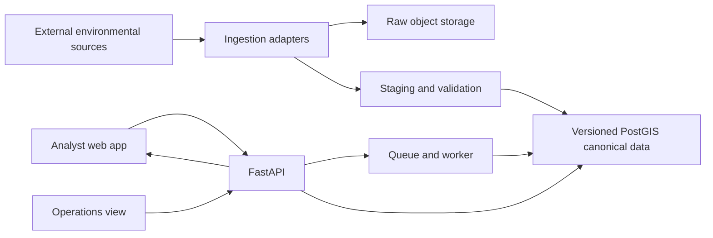

# Architecture

## Status and evidence convention

This document records the intended architecture and separates it from the verified repository baseline. The current checkout contains governance documents and completed planning records, but no application implementation, configuration, tests, or deployment behavior was verified. Statements below are therefore labeled as intended, unresolved, or verified where relevant.

| Label | Meaning |
| --- | --- |
| **Verified** | Supported by inspected repository behavior, configuration, tests, or deployment evidence. |
| **Intended** | The agreed direction for implementation, not evidence that it exists. |
| **Unresolved** | Requires research, development judgment, or owner decision. |

## Architectural objective

The platform should be a coherent small application whose sophistication comes from reliable geospatial data operations rather than service proliferation. It should acquire external data, preserve raw inputs, validate and normalize them, promote safe versions into PostGIS, run transparent screenings asynchronously, and expose the results through an API and MapLibre web application.

## Verified current boundary

The only verified project structure is the governance/documentation set described in `docs/PROJECT_STATE.md`. No API, worker, database, storage, frontend, source adapter, deployment, or runtime boundary exists yet. The system shape and technology choices below are intended directions, not an implementation diagram.

## Intended system shape



The diagram is an intended boundary model, not a verified deployment diagram.

## Technology direction

| Area | Intended direction | Status |
| --- | --- | --- |
| Backend language | Python | Intended |
| API | FastAPI with typed schemas and OpenAPI | Strongly preferred; not implemented |
| Database | PostgreSQL + PostGIS | Core requirement; not implemented |
| Migrations | Alembic | Strongly preferred; not implemented |
| Geospatial processing | GeoPandas, GDAL, Rasterio, Shapely, PyProj, SQL/PostGIS as appropriate | Candidate stack; source-dependent |
| Frontend | React + TypeScript | Strongly preferred; not implemented |
| Mapping | MapLibre | Strongly preferred; not implemented |
| Background processing | Lightweight queue and worker, likely Redis-backed | Unresolved implementation choice |
| Raw storage | S3-compatible object storage, likely MinIO locally and an affordable hosted equivalent | Provider unresolved |
| Local environment | Docker Compose | Strongly preferred; not implemented |
| CI/CD | GitHub Actions | Preferred; not implemented |

## Application components

### Frontend

The React/TypeScript application is intended to provide:

- project list and project creation;
- study-area drawing and visualization;
- screening submission and job-state display;
- result summary and per-dataset findings;
- MapLibre map with selectively visible constraint layers;
- CSV/spatial downloads;
- source and data-health operations view.

Authentication, navigation structure, and exact responsive behavior remain unresolved. Desktop/laptop is primary, with usable smaller-screen behavior expected but not full mobile parity.

### API

FastAPI is intended to be the application boundary for:

- projects and project areas;
- screening submission, status, and results;
- environmental dataset and version metadata;
- ingestion/status information;
- health and readiness checks;
- downloads or download metadata.

The API should use explicit request/response schemas, validation, stable error responses, and OpenAPI documentation. Exact route names and authentication behavior are unresolved.

### Worker and scheduler

A lightweight background process is intended to run screening jobs and likely ingestion jobs. It should support queued, processing, completed, and failed states, retries, useful failure messages, and idempotent execution.

Periodic source checking is intended, but the scheduler mechanism and source-specific frequencies remain unresolved. A scheduled trigger should be able to no-op when a source has not changed.

### Ingestion adapters

Source-specific adapters should encapsulate acquisition and parsing differences without creating a giant hard-coded script. They should support, where applicable:

- pagination;
- retries and timeouts;
- ETags, release metadata, timestamps, or checksums for change detection;
- raw snapshot recording;
- source-specific schema and spatial validation;
- reproducible staging into canonical structures.

The product contract and common/source-specific adapter boundaries are now defined in `docs/SCREENING_CONTRACT.md` under Milestone 2A; no implementation exists. Geography is validated and representative acquisition tests have established candidate patterns, but FEMA access and complete regional PAD-US package access still block final source approval.

#### Evidence-informed source acquisition assumptions (not implemented)

- **PAD-US:** the official 4.1 MapServer returns versioned polygon features and useful categorical/source fields, but its service directory exposes only the Fee layer. The complete Colorado state geodatabase package is linked through official USGS/ScienceBase but its item/file route returned HTTP 403 in this session. The owner-approved policy preserves raw shapes and attributes, runs deterministic `make_valid` only in derived staging, checks equal-area change and topology, and quarantines candidates that fail. In the five-feature sample, two valid features were accepted unchanged and three repaired candidates quarantined; this sample is not a regional count or coverage estimate. No full regional QA is claimed until the complete package is acquired.
- **Annual NLCD:** official WCS supports a 2025 windowed GeoTIFF response. The measured service response was EPSG:3857; preserve time/version and actual returned grid metadata. Do not assume it is the native Albers tile or download the national historical bundle.
- **3DEP:** TNM lists dated 1/3-arc-second one-degree GeoTIFFs with per-item sizes. One tile is 413.48 MB; the region bounding-box inventory is eight tiles/about 3.07 GB, an upper bound pending exact polygon tile intersection. Keep tile date/checksum provenance and window downstream processing.
- **SSURGO:** official SDA spatial queries locate map units and survey areas and return map-unit WKT plus component attributes. The union intersects 19 survey areas (1,878 map units across those whole areas); a small query returned component/hydric fields. Preserve `mukey`/`cokey`, `comppct_r`, rating nulls, and per-area release metadata. Full survey-area package byte totals remain unmeasured.
- **FEMA NFHL:** no service data or sample was obtained. Effective and pending products remain separate; missing coverage stays unknown. No FEMA adapter assumptions beyond provider metadata are validated.

The product-facing maturity vocabulary (`validated`, `conditionally_validated`, `access_blocked`, `failed`, `not_acquired`), separate AOI coverage states, and missing-data outcomes are specified in `docs/SCREENING_CONTRACT.md`. They are design contracts only, not runtime state or database enums.

### Screening engine

The screening engine should evaluate each project AOI independently against each active source version. It should prefer direct, interpretable physical metrics over a composite environmental score. Likely operations include intersection, area and percentage calculations, line length, proximity, and raster statistics where a raster source is selected.

The owner-selected working geography is the validated three-county union (Boulder, Larimer, Weld; approximately 7,391 sq mi), including all three disconnected union components. Regional raster inputs are to be acquired by intersecting tile/window and processed with bounded AOI windows; no full national raster series is to be downloaded. The selected hydric-soil source is SSURGO: it is soil survey information, not a wetlands inventory. Component hydric ratings must retain their map-unit/component context and unknown/unranked states; they must not be presented as mapped wetlands or as evidence that jurisdictional wetlands are present or absent. Flood results must distinguish effective from pending FEMA data and treat unmapped/unavailable coverage as unknown. These are intended processing constraints, not implemented behavior.

Regulatory thresholds, hazard interpretations, and environmental categorization language must not be invented by an agent. They require evidence and owner review.

## Data and storage architecture

### Raw, staging, and canonical layers

The intended lineage is:

```text
external source
  -> source catalog
  -> raw snapshot in object storage
  -> staging and source-specific validation
  -> normalized canonical dataset in PostGIS
  -> validated active dataset version
  -> screening result linked to used versions
```

Raw source material should retain acquisition time, source identity, original metadata where useful, checksum, and source version/release information when available. Raw data is not expected to be committed to Git.

### Conceptual database entities

The schema is expected to include concepts such as:

- `datasets`: logical environmental sources and provider/license metadata;
- `dataset_versions`: acquired, validated, active, or superseded versions;
- `ingestion_runs`: attempts, status, timing, checksums, counts, validation results, and errors;
- normalized environmental layer tables: source-specific canonical spatial data;
- `projects`: analyst-created screening projects;
- `project_areas`: project geometry and relevant geometry metadata;
- `screening_jobs`: requested workflow, status, retry/error information, and timestamps;
- `screening_results`: per-dataset metrics, result geometries or references, and source-version lineage.

Exact normalization, table names, geometry types, raster strategy, and retention rules are development decisions constrained by the selected sources.

### Spatial database expectations

PostGIS is a core architectural boundary, not a résumé-only dependency. The implementation should use intentional geometry columns, GiST spatial indexes, suitable conventional indexes, migrations, and query profiling. Techniques such as subdivision should be used only where actual data and query plans justify them.

### Version activation

An ingestion run should not make a dataset active merely because acquisition or parsing succeeded. A validated new version should be promoted atomically or through an equivalently safe transaction, while the previous valid version remains available if validation fails.

## Processing pipelines

### Source refresh pipeline

```text
scheduled check
  -> determine whether upstream changed
  -> acquire source
  -> checksum and record provenance
  -> stage and normalize
  -> run source-specific data-quality gates
  -> load candidate version
  -> promote if valid
  -> expose status and logs
```

The pipeline must be retry-safe and idempotent. Failed candidates must not silently replace an active version.

### Screening pipeline

```text
API accepts project/screening request
  -> create queued job
  -> worker claims job
  -> resolve active dataset versions
  -> calculate per-source metrics
  -> persist results and lineage
  -> mark complete or failed
  -> API/frontend retrieve status and results
```

The screening should remain small enough for modest hosted resources. Long-running spatial work should not depend on an open HTTP request.

## External dependencies and data sources

The owner-selected working geography is the three 2025 Census counties Boulder (08013), Larimer (08069), and Weld (08123), about 7,391.206 sq mi in the official TIGER/Line 2025 geometry. The archive and selected GEOID subset are outside Git. The valid NAD83/EPSG:4269 union is a three-component MultiPolygon with one main connected county body and two small detached source components; preserve them rather than narrowing the boundary. The older generalized TIGERweb sample is diagnostic only. The owner-selected MVP source direction is FEMA NFHL, USGS PAD-US 4.1, USGS Annual NLCD Collection 1.2 (2025 land cover), USGS 3DEP 1/3 arc-second DEM, and NRCS SSURGO component hydric-soil information. NWI was superseded for the MVP because exact release-specific redistribution terms could not be confirmed; it is not a substitute or current dependency. Representative NLCD, one 3DEP tile, and SSURGO SDA samples were acquired. PAD-US's five-feature Fee sample has two unchanged accepted records and three quarantined repaired candidates under the owner-approved policy; official access to the complete Colorado state package returned HTTP 403, so no complete regional intersection or quarantine/gap results are known. FEMA remains provider-access blocked with no effective/pending sample validation. No source adapter or application behavior is implemented. See `docs/SOURCE_FEASIBILITY.md` and the external manifest for measured evidence and remaining gaps.

The source-feasibility document distinguishes owner direction and official-record rights/access evidence from artifact-level validation. Do not treat catalogue metadata as proof of a downloaded product's integrity or regional coverage. Preserve version/effective-date provenance; for FEMA keep pending products apart from effective products, and for all sources represent absent/unavailable coverage as unknown rather than a negative environmental finding.

## Deployment architecture

The intended hosted shape requires:

- a deployable frontend;
- a running API;
- a worker and queue mechanism;
- managed PostgreSQL/PostGIS or an equivalent hosted database;
- object storage for raw snapshots;
- automated main-branch deployment;
- migration handling;
- post-deployment health/smoke checks.

The hosting provider, container runtime, database provider, object-storage provider, secrets mechanism, and rollback approach are unresolved. A purely static host is insufficient for the intended architecture.

## Important technical boundaries

- The platform is one coherent application, not a collection of microservices.
- Raw source preservation is separate from canonical active data.
- Staging/validation is separate from activation.
- Dataset version metadata and screening lineage are first-class concerns.
- The API is the frontend's application boundary; direct database access from the browser is not intended.
- Background processing owns long-running ingestion and screening work.
- Product-facing screening results must remain transparent and preliminary.
- Authentication, if added, should be simple and must not grow into enterprise IAM.
- Infrastructure must remain proportional: no Kubernetes, Kafka, distributed-compute layer, or Terraform requirement without a demonstrated need.

## Architecture decisions still required

The geography and MVP source direction are owner-selected, but final source approval remains open for full regional PAD-US coverage/repair statistics and FEMA technical access plus effective/pending validation. Milestone 2A has defined the initial screening workflow, metric semantics, provenance, uncertainty, and adapter contracts in `docs/SCREENING_CONTRACT.md`; this controlled progression does not imply final source approval or implementation readiness. Later owner/development decisions include queue/worker library, raster storage strategy, authentication, hosting, source refresh schedule, screening immutability/re-screening behavior, export formats, and whether PDF reporting is retained. The contract must be rechecked against full regional source evidence before implementation.
