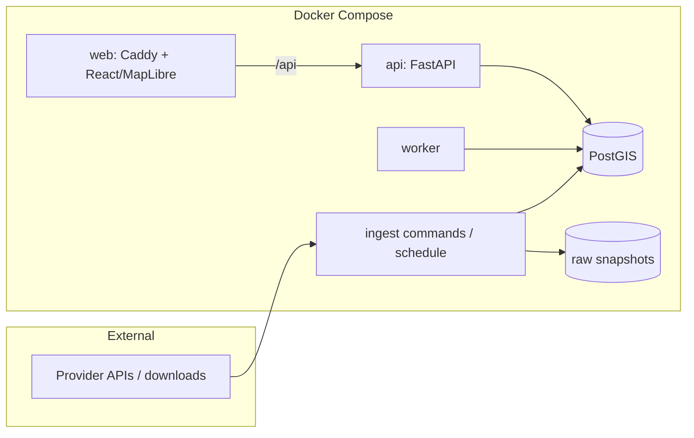

# Architecture

A small, coherent application: one Python codebase (API + worker + ingestion commands), one
PostGIS database, one static React app behind Caddy. Deployed as a Docker Compose stack on a
single VM (D7).

## Data lifecycle (per source)

1. **Acquire** — download to an immutable raw snapshot: checksum, URL, retrieval time,
   provider release identifier. Same checksum as an existing snapshot → no new version.
2. **Stage** — parse into a staging table keyed by the new dataset version; transform to the
   canonical CRS; repair geometry only here, keeping originals.
3. **Validate** — source-specific gates (schema, SRID, geometry validity, plausible counts,
   region coverage). Failure leaves the version `failed`; the active version is untouched.
4. **Promote** — in one transaction, mark the version active. Canonical tables carry a
   `dataset_version_id`, so previous versions remain queryable for reproducibility.

Rasters (NLCD, 3DEP) follow the same lifecycle; the pixels live as Cloud-Optimized GeoTIFFs
on disk and the catalog/version rows live in PostGIS.

## Screening jobs

`POST` a screening → a `queued` row in `screening_jobs` → a worker claims it with
`FOR UPDATE SKIP LOCKED` → it computes per-source metrics against the **active versions at
claim time**, recording those version IDs with the results → `succeeded` / `failed`, with
retries. One source failing does not fail the others.

## Status

| Component | State |
|---|---|
| Compose stack (db, migrate, api, web), Alembic baseline, `/api/health`, JSON logs | Implemented |
| React/MapLibre shell with live system status | Implemented |
| CI: lint, types, tests on PostGIS, frontend build, compose smoke | Implemented |
| Dataset catalog/versions, ingestion, projects/AOIs, jobs, worker, screening | Planned (Phase 1+) |
| Deployment, scheduled refresh, rate limiting | Planned |
