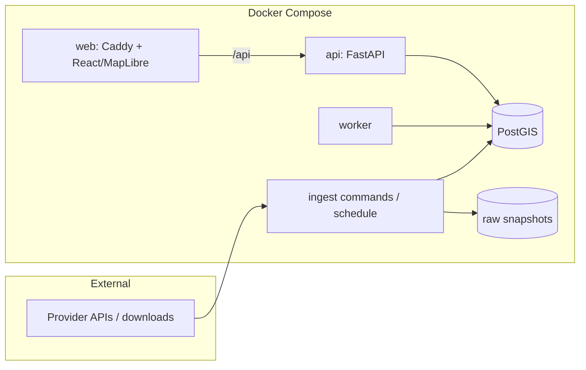

# Architecture

A small, coherent application: one Python codebase (API + worker + ingestion commands), one
PostGIS database, one static React app behind Caddy. Deployed as a Docker Compose stack on a
single VM (D7).

## Data lifecycle (per source)

1. **Acquire** — download to an immutable raw snapshot: checksum, URL, retrieval time,
   provider release identifier. Same checksum as an existing snapshot → no new version.
2. **Stage/load** — parse the raw snapshot, `COPY` source geometries into a temporary staging
   table, then insert them into the canonical tables under the new `version_id` (invisible to
   screenings until promoted). Invalid geometries are repaired with `ST_MakeValid` here and
   flagged `repaired`; the raw snapshot keeps the originals.
3. **Validate** — source-specific gates (schema, SRID, geometry validity, plausible counts,
   region coverage). Failure leaves the version `failed`; the active version is untouched.
4. **Promote** — in one transaction, mark the version active. Canonical tables carry a
   `version_id`, so previous versions remain queryable for reproducibility.

Rasters (NLCD, 3DEP) follow the same lifecycle; the pixels live as Cloud-Optimized GeoTIFFs
on disk and the catalog/version rows live in PostGIS.

## Screening jobs

`POST /api/screenings` validates the AOI (valid geometry, inside the region, size limit),
stores it, and queues a job **pinned to the active dataset versions at submission**, so a
retry or a later promotion never changes what the job computes. A worker claims it with
`FOR UPDATE SKIP LOCKED`; a job whose worker died is reclaimed when its lease expires.
Per-dataset results are upserted (retries never duplicate), each carrying one status:
`complete`, `partial_coverage`, `not_covered` (area outside the dataset's coverage is
reported as not assessed, never as absence), `unavailable` (no active version), or
`failed` (that dataset only; others still complete). Transient job-level errors are retried
with backoff up to `max_attempts`.

Update detection for SSURGO compares each survey area's `saverest` in Soil Data Access with
the active version before downloading anything; identical raw content is never loaded twice.

## Status

| Component | State |
|---|---|
| Compose stack (db, migrate, api, worker, web), Alembic baseline, `/api/health`, JSON logs | Implemented |
| React/MapLibre shell with live system status | Implemented |
| CI: lint, types, tests on PostGIS, frontend build, compose smoke | Implemented |
| Catalog (datasets, versions, raw snapshots, ingestion runs) with validation gates and atomic promotion | Implemented |
| SSURGO ingestion (`esp ingest ssurgo`), hydric-class screening, clipped features | Implemented (verified live with CO644, Larimer County Area) |
| AOIs, PostgreSQL job queue, worker service, `/api/screenings`, `/api/datasets` | Implemented |
| React UI: draw/upload/example AOI, job status polling, results, map layer, data sources | Implemented |
| CI end-to-end smoke (fixture ingest → screening → results through the web proxy) | Implemented |
| NLCD, FEMA NFHL, PAD-US, 3DEP; statewide SSURGO; exports | Planned |
| Deployment, scheduled refresh, rate limiting | Planned |
