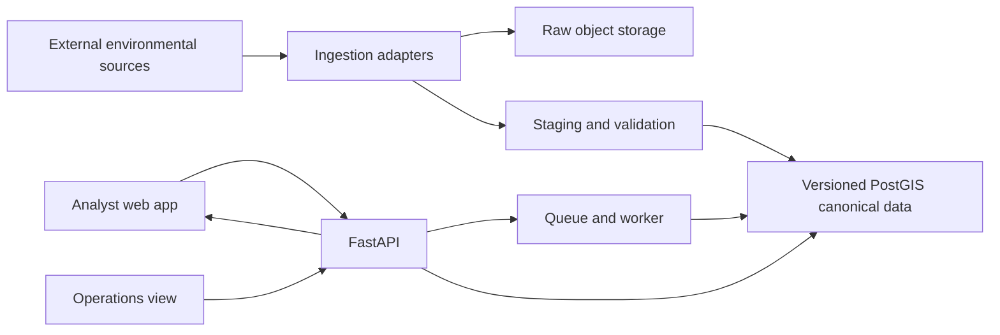

# Architecture

## Status and evidence convention

This document separates the intended platform from the verified Milestone 2B local prototype. The implementation currently consists of a Python CLI, file-backed project/AOI/job records, four narrowly scoped source pathways, a fixture-only SSURGO PostGIS load, bounded SSURGO screening consumption, bounded snapshot-pinned NLCD/3DEP raster screening, and bounded multi-source fixture orchestration; it is not the intended hosted application. Statements below are labeled as intended, unresolved, or verified where relevant.

| Label | Meaning |
| --- | --- |
| **Verified** | Supported by inspected repository behavior, configuration, tests, or deployment evidence. |
| **Intended** | The agreed direction for implementation, not evidence that it exists. |
| **Unresolved** | Requires research, development judgment, or owner decision. |

## Architectural objective

The platform should be a coherent small application whose sophistication comes from reliable geospatial data operations rather than service proliferation. It should acquire external data, preserve raw inputs, validate and normalize them, promote safe versions into PostGIS, run transparent screenings asynchronously, and expose the results through an API and MapLibre web application.

## Verified current boundary

Verified implementation is the local workflow in `src/environmental_screening_platform/`: Python CLI, official Census boundary acquisition/parser, NLCD WCS window and exact-snapshot raster summary, 3DEP ImageServer window and exact-snapshot elevation summary, SSURGO SDA query, fixture-only PostGIS map-unit/component load, snapshot-pinned fixture-only SSURGO screening query, JSON project/AOI/job state, provenance/raw-byte storage, metrics, exports, and an optional PostGIS repository boundary. It stores operational data only under a caller-supplied external data directory. There is no deployed database, API, queue/worker service, frontend, or production/active regional environmental canonical data promotion. The architecture diagram remains the intended target, not an implementation diagram.

### Verified local execution boundary (Milestone 2B)

- `screening project-create` obtains/caches the exact 2025 Census county boundary as needed, validates a WGS84 Polygon/MultiPolygon AOI against the full union, and records immutable project/AOI-revision JSON outside Git.
- `screening screen` persists a job, runs the local worker synchronously, and records `queued → processing → completed/failed`; independent source failures remain source-level outcomes. Failed jobs may be retried against the same immutable AOI; completed results are immutable.
- `screening screen-ssurgo-fixture` creates a single-source job in explicit `ssurgo_fixture_only` mode, resolves the immutable SQLite SSURGO snapshot, and queries only the matching PostGIS snapshot/version pair. It never selects latest data or a regional source version. `screening screen --database-url ...` can use the same bounded SSURGO path when the requested job contains an eligible snapshot.
- `screening screen-nlcd-fixture` creates a single-source job in explicit `nlcd_fixture_only` mode and opens only the exact external NLCD GeoTIFF named by the immutable SQLite snapshot. It records raster footprint coverage, valid/nodata pixels, class counts/percentages, CRS, transform, resolution, dimensions, nodata, and source year. Raster pixels remain external artifacts; no NLCD pixel table is added to PostGIS.
- `screening screen-3dep-fixture` creates a single-source job in explicit `3dep_fixture_only` mode and opens only the exact external 3DEP DEM named by the immutable SQLite snapshot. It records footprint coverage, valid/nodata cells, raw elevation min/max/mean/percentiles, CRS, resolution, dimensions, transform, nodata, vertical metadata where present, and source-version provenance. It may export one source-footprint feature; it does not add pixels to PostGIS or calculate slope.
- `screening screen-fixtures` creates a bounded five-source job against the validated Census AOI revision. It runs the existing SSURGO, NLCD, and 3DEP fixture paths against exact snapshot rows, carries PAD-US quarantined and FEMA blocked outcomes without processing them, and emits an overall partial/fixture-only outcome plus a source-status matrix. It does not create a composite result or cross-source geometry.
- Raw provider responses are content-addressed by SHA-256 and stored outside the repository. Each acquisition event records actual response URL/media type, exact request parameters, retrieval time, size, checksum, release label, and terms URL. HTTPS and same-host redirects are required; response size and request dimensions are bounded. The regional SSURGO package workflow additionally records provider-reported and measured sizes, selected HTTP headers, ZIP CRC/package-structure validation, and one inactive candidate/source-version/run per survey area; it does not extract or promote regional canonical data.
- Source adapters are project-owned. Current successful small-AOI pathways are TIGER/Line 2025, Annual NLCD 2025 WCS, USGS 3DEP ImageServer, and NRCS SDA SSURGO. Successful live smoke requests are evidence only for those small windows and do not expand the source validation scopes recorded in the contract.
- PAD-US and FEMA are emitted as explicit not-acquired outcomes: PAD-US remains conditionally validated with regional coverage unknown and the prior sample quarantine counts shown; FEMA remains access-blocked with no effective/pending data. No fallback source is used.
- Results are JSON; CSV carries one row per source including state/provenance/metrics; GeoJSON carries the AOI plus valid SSURGO clipped map-unit features. Raster products are summarized rather than exported as raster layers. GeoJSON does not imply that a missing source has no findings.
- SSURGO fixture results carry `source_status=fixture_only`, `screening_status` (`observed`, `no_indicator_observed`, or `uncovered`), source snapshot/version provenance, covered and uncovered AOI areas, map-unit/component counts, and the explicit hydric-soil limitation label. Component attributes are not spatially delineated within map units. Regional survey-area ZIP candidates are separate inactive validation records and are not consumed by this fixture screening path.
- NLCD fixture results carry `source_status=fixture_only`, `screening_status` (`observed`, `nodata`, or `uncovered`), exact source snapshot/version provenance, raster footprint and covered/uncovered AOI areas, valid/nodata pixel counts, class counts/percentages, and source grid metadata. JSON/CSV include the summary; GeoJSON contains no fabricated pixel features.
- 3DEP fixture results carry `source_status=fixture_only`, `screening_status` (`observed`, `nodata`, or `uncovered`), exact source snapshot/version provenance, raster footprint and covered/uncovered AOI areas, valid/nodata cell counts, raw elevation statistics, CRS/grid/nodata metadata, and vertical units/datum when declared. GeoJSON may contain one meaningful raster footprint and never pixel features.
- The unified fixture result preserves independent source results and adds `overall_status`, `product_status`, `availability_status`, `job_outcome`, and `source_status_matrix`. `job_status=completed` means the bounded orchestration wrote a result; `overall_status=partial` makes blocked, quarantined, incomplete, and unavailable evidence visible rather than treating it as absence.
- This is job-oriented, not genuinely asynchronous: the CLI command itself waits while the local worker runs. AOIs exceeding configured NLCD/3DEP request cell limits currently produce explicit source failure/unknown outcomes; multi-window tiling is future work.

## Intended system shape



The diagram is an intended boundary model, not a verified deployment diagram.

## Technology direction

| Area | Intended direction | Status |
| --- | --- | --- |
| Backend language | Python package and CLI | Implemented prototype; production backend/API not implemented |
| API | FastAPI with typed schemas and OpenAPI | Strongly preferred; not implemented |
| Database | PostgreSQL + PostGIS | Local AOI and fixture-only SSURGO schema boundaries implemented; hosted database and active regional environmental schema not implemented |
| Migrations | Alembic / SQL migration boundary | Two local SQL migrations implemented for AOI and representative SSURGO fixture boundaries; Alembic history not implemented |
| Geospatial processing | Rasterio, NumPy, Shapely, PyProj, pyshp; SQL/PostGIS later | Initial local dependencies implemented; source-dependent expansion |
| Frontend | React + TypeScript | Strongly preferred; not implemented |
| Mapping | MapLibre | Strongly preferred; not implemented |
| Background processing | Lightweight queue and worker, likely Redis-backed | Unresolved implementation choice |
| Raw storage | S3-compatible object storage, likely MinIO locally and an affordable hosted equivalent | Provider unresolved |
| Local environment | Docker Compose | Strongly preferred; not implemented |
| CI/CD | GitHub Actions | Preferred; not implemented |

## Application components

### Frontend

The React/TypeScript application is intended to provide:

- project list and project creation;
- study-area drawing and visualization;
- screening submission and job-state display;
- result summary and per-dataset findings;
- MapLibre map with selectively visible constraint layers;
- CSV/spatial downloads;
- source and data-health operations view.

Authentication, navigation structure, and exact responsive behavior remain unresolved. Desktop/laptop is primary, with usable smaller-screen behavior expected but not full mobile parity.

### API

FastAPI is intended to be the application boundary for:

- projects and project areas;
- screening submission, status, and results;
- environmental dataset and version metadata;
- ingestion/status information;
- health and readiness checks;
- downloads or download metadata.

The API should use explicit request/response schemas, validation, stable error responses, and OpenAPI documentation. Exact route names and authentication behavior are unresolved.

### Worker and scheduler

A lightweight background process is intended to run screening jobs and likely ingestion jobs. It should support queued, processing, completed, and failed states, retries, useful failure messages, and idempotent execution.

Periodic source checking is intended, but the scheduler mechanism and source-specific frequencies remain unresolved. A scheduled trigger should be able to no-op when a source has not changed.

### Ingestion adapters

Source-specific adapters should encapsulate acquisition and parsing differences without creating a giant hard-coded script. They should support, where applicable:

- pagination;
- retries and timeouts;
- ETags, release metadata, timestamps, or checksums for change detection;
- raw snapshot recording;
- source-specific schema and spatial validation;
- reproducible staging into canonical structures.

The product contract and common/source-specific adapter boundaries are defined in `docs/SCREENING_CONTRACT.md`. A first local subset is implemented, including a fixture-only SSURGO canonical query; it does not implement production/regional canonical promotion, source catalog/version transactions in PostGIS, or adapters for PAD-US/FEMA. FEMA access and complete regional PAD-US package access still block final source approval.

#### Source acquisition and implementation status

- **PAD-US:** the official 4.1 MapServer returns versioned polygon features and useful categorical/source fields, but its service directory exposes only the Fee layer. The complete Colorado state geodatabase package is linked through official USGS/ScienceBase but its item/file route returned HTTP 403 in this session. The owner-approved policy preserves raw shapes and attributes, runs deterministic `make_valid` only in derived staging, checks equal-area change and topology, and quarantines candidates that fail. In the five-feature sample, two valid features were accepted unchanged and three repaired candidates quarantined; this sample is not a regional count or coverage estimate. No full regional QA is claimed until the complete package is acquired.
- **Annual NLCD:** implemented WCS 1.0.0 GetCoverage for the advertised offering name and 2025 time position, bounded to the AOI. A live 3×4 EPSG:3857 GeoTIFF sample passed; class areas transform cell corners to EPSG:5070. The screening path reads only the exact snapshot artifact and reports footprint coverage, valid/nodata pixels, class counts/percentages, CRS, transform, resolution, dimensions, nodata, and source year. This is a service-delivered grid, not a native Albers tile. Full regional output, mosaic/window splitting, and production readiness remain unverified.
- **3DEP:** implemented official ImageServer AOI windowing at requested 10 m EPSG:5070 with bilinear interpolation and a 12-million-cell ceiling; live small raster passed. The screening path reads only the exact snapshot artifact, preserves raw elevation values, reports coverage/valid/nodata/statistics and raster metadata, and does not convert units/datum or derive slope. This is a resampled service response, not downloaded raw tile bytes; tile inventory IDs and underlying revision dates are not currently attached. Prior TNM 8-tile/3.07-GB bounding-box estimate remains an estimate, not this adapter's acquisition list.
- **SSURGO:** implemented bounded SDA Post REST query using the official clipped-mapunit macro, returning AOI-clipped mapunit polygons and component attributes. A 1,893-byte live query returned 3 map units/6 unique component rows and full polygon coverage of a 0.00948 km² test AOI. Component hydric rating is soil information, not a wetlands inventory or regulatory determination. The exact approved three-county union has 19 confirmed intersecting survey areas; the automated regional package workflow acquired all 19 official WSS ZIPs, measured 394,959,419 compressed bytes matching provider `Content-Length`, and passed CRC/spatial/tabular container validation. Packages remain inactive and unparsed; complete regional canonical coverage remains unverified.
- **FEMA NFHL:** no service data or sample was obtained. Effective and pending products remain separate; missing coverage stays unknown. No FEMA adapter assumptions beyond provider metadata are validated.

The product-facing maturity vocabulary (`validated`, `conditionally_validated`, `access_blocked`, `failed`, `not_acquired`), separate AOI coverage states, observation outcomes, and missing-data behavior are runtime JSON fields for this slice. They are not database enums. A source's static validation maturity and a per-run `attempt_status` remain separate; per-run success does not rewrite source maturity or complete Milestone 1 approval.

### Screening engine

The screening engine should evaluate each project AOI independently against each active source version. The verified SSURGO fixture path evaluates only the exact snapshot/version captured by the job and uses direct intersection, area, percentage, map-unit, and component metrics. The verified NLCD fixture path reads only the exact snapshot raster, uses the AOI/raster-footprint intersection and native categorical cells, and reports explicit valid/nodata/class metrics without creating a PostGIS pixel table. The verified 3DEP fixture path reads only the exact snapshot raster, uses the same AOI/raster-footprint accounting, and reports raw elevation statistics without creating a PostGIS pixel table or derived slope. It should prefer direct, interpretable physical metrics over a composite environmental score. Likely operations include intersection, area and percentage calculations, line length, proximity, and raster statistics where a raster source is selected.

The owner-selected working geography is the validated three-county union (Boulder, Larimer, Weld; approximately 7,391 sq mi), including all three disconnected union components. The local prototype validates AOI containment and uses bounded raster windows; it does not yet tile larger AOIs. SSURGO output retains map-unit/component context and explicitly says that hydric ratings are soil information, not wetlands mapping or evidence of jurisdictional-wetland presence/absence. FEMA's effective/pending path is not implemented; the result remains blocked/unavailable, and the target contract requires unmapped/unavailable areas to stay unknown. Other full source metrics remain intended or partially implemented per `SCREENING_CONTRACT.md`.

Regulatory thresholds, hazard interpretations, and environmental categorization language must not be invented by an agent. They require evidence and owner review.

## Data and storage architecture

### Raw, staging, and canonical layers

The intended lineage is:

```text
external source
  -> source catalog
  -> raw snapshot in object storage
  -> staging and source-specific validation
  -> normalized canonical dataset in PostGIS
  -> validated active dataset version
  -> screening result linked to used versions
```

Raw source material should retain acquisition time, source identity, original metadata where useful, checksum, and source version/release information when available. Raw data is not expected to be committed to Git.

The local slice implements this as an external filesystem raw store with content-addressed response bytes and append-only acquisition event JSON. Project, AOI, job, result, CSV, and GeoJSON files also live under that external directory. Milestone 2B.2 adds a backend-neutral `SourceRepository` interface with a local SQLite metadata implementation under `catalog/`; SQLite transactions serialize candidate registration and promotion. Milestone 2B.4 adds a separate optional `SpatialRepository` interface with a local PostGIS implementation under `spatial.py`; it stores canonical AOI geometry and the fixture-only SSURGO map-unit/component records, links to SQLite-owned source snapshot/version IDs as explicit text, and has no cross-database foreign keys. SSURGO staging, validation, and fixture-only promotion are defined in migration `002_ssurgo_mapunits`; the fixture is not an active regional source version. Raw files have no object-lock or retention guarantee, and the existing JSON project/job store still has no concurrent-worker or multi-record transaction guarantee. PostGIS remains the intended canonical spatial store and hosted repository target.

The local PostGIS setup is `postgis/postgis:16-3.4` with a health check and an externally configured bind-mounted data directory. Credentials and the connection URL are environment-provided. Migration `001_aoi_revisions.sql` creates the AOI boundary: canonical AOI revisions, preserved source components, spatial indexes, validity constraints, source/analysis CRS metadata, and provenance. Migration `002_ssurgo_mapunits.sql` adds SSURGO batch/staging tables and separate fixture-only canonical map-unit/component tables. The Census boundary loader transforms preserved EPSG:4269 county geometries to EPSG:4326 canonical geometry and measures area in EPSG:5070; it does not narrow, repair, or silently discard the approved counties. The SSURGO loader preserves provider `mukey`/`cokey` and hydric fields, validates joins and geometry, records source snapshot/version and optional ingestion/candidate linkage, and promotes only as `fixture_only` for the representative partial response. Both migrations and loaders were executed successfully against the pinned container on 2026-09-23, including direct validity, component, CRS, linkage, idempotency, and transaction-rollback checks. This verifies the local repository boundary and fixture path only, not a deployed database, active regional source version, or environmental source completeness.

### Conceptual database entities

The schema is expected to include concepts such as:

- `datasets`: logical environmental sources and provider/license metadata;
- `dataset_versions`: acquired, validated, active, or superseded versions;
- `ingestion_runs`: attempts, status, timing, checksums, counts, validation results, and errors;
- normalized environmental layer tables: source-specific canonical spatial data;
- `projects`: analyst-created screening projects;
- `project_areas`: project geometry and relevant geometry metadata;
- `screening_jobs`: requested workflow, status, retry/error information, and timestamps;
- `job_source_snapshots`: immutable per-job/AOI source-version resolution and missing-data state;
- `screening_results`: per-dataset metrics, result geometries or references, and source-version lineage.

Exact normalization, table names, geometry types, raster strategy, and retention rules are development decisions constrained by the selected sources.

### Spatial database expectations

PostGIS is a core architectural boundary, not a résumé-only dependency. The implementation should use intentional geometry columns, GiST spatial indexes, suitable conventional indexes, migrations, and query profiling. Techniques such as subdivision should be used only where actual data and query plans justify them.

### Version activation

The local catalog implements candidate-first acquisition metadata for Census, NLCD, 3DEP and SSURGO. The acquisition callback durably creates an `incomplete` candidate and checksum/release version before parsing; adapter validation finalizes that candidate as validated, failed, or incomplete. Each run, acquisition attempt, candidate validation and immutable `(source, release, SHA-256)` version is queryable; PAD-US quarantine and FEMA blocked outcomes are recorded without acquisition or promotion. Explicit promotion verifies candidate/run/validation/coverage/quarantine states and re-hashes the external artifact inside a SQLite `BEGIN IMMEDIATE` transaction before advancing the active-version pointer. Failed, partial, quarantined or blocked candidates cannot activate; version bytes and metadata are retained when a later version is promoted. Repeating a decision for the same candidate is idempotent.

When a screening job is created, the catalog resolves every requested source against the active pointer and writes an immutable `job_source_snapshots` row before processing. Each row records the job/AOI revision, source version when available, candidate/run lineage, maturity, coverage, observation, snapshot status, reason, and provenance. The worker reads that snapshot only: it does not acquire a newer candidate or re-resolve the active pointer. A missing or checksum-invalid artifact becomes unavailable for that execution without mutating the historical snapshot. Retry reuses the same rows; a new `create_job` call is the explicit fresh-snapshot operation. This does not load canonical geometry/raster data into PostGIS.

## Processing pipelines

### Source refresh pipeline

```text
scheduled check
  -> determine whether upstream changed
  -> acquire source
  -> checksum and record provenance
  -> stage and normalize
  -> run source-specific data-quality gates
  -> load candidate version
  -> promote if valid
  -> expose status and logs
```

The `screening ingest` CLI runs an explicit source acquisition as an inactive candidate. Inspection commands list ingestion runs, source versions, candidates by source/status, acquisition attempts/validation from candidate detail, and the active version; `retry-ingestion` creates a new linked run instead of erasing the failed attempt. `promote-candidate` is a separate owner/operator action. Screening job creation now snapshots the active pointer for every requested source, including explicit PAD-US quarantine and FEMA access-blocked states; execution and retry use those exact rows. The bounded SSURGO fixture mode consumes only matching fixture-only PostGIS rows; it does not provide general canonical loading, source scheduling, provider change detection, or asynchronous queue execution.

The pipeline must be retry-safe and idempotent. Failed candidates must not silently replace an active version.

### Screening pipeline

The current CLI writes a `queued` job and synchronously processes its already-persisted source snapshot. Missing active versions and unavailable artifacts remain source-level outcomes; they are never replaced by live acquisition or a newer candidate. The explicit SSURGO fixture mode queries the AOI against only the snapshot-pinned fixture rows and preserves uncovered/unknown/unavailable distinctions. This is not an asynchronous service or queue.

```text
API accepts project/screening request (intended; not implemented)
  -> create queued job
  -> worker claims job
  -> resolve active dataset versions
  -> calculate per-source metrics
  -> persist results and lineage
  -> mark complete or failed
  -> API/frontend retrieve status and results
```

The screening should remain small enough for modest hosted resources. Long-running spatial work should not depend on an open HTTP request.

## External dependencies and data sources

The owner-selected working geography is the three 2025 Census counties Boulder (08013), Larimer (08069), and Weld (08123), about 7,391.206 sq mi in the official TIGER/Line 2025 geometry. The archive and selected GEOID subset are outside Git. The valid NAD83/EPSG:4269 union is a three-component MultiPolygon with one main connected county body and two small detached source components; preserve them rather than narrowing the boundary. The older generalized TIGERweb sample is diagnostic only. The owner-selected MVP source direction is FEMA NFHL, USGS PAD-US 4.1, USGS Annual NLCD Collection 1.2 (2025 land cover), USGS 3DEP 1/3 arc-second DEM, and NRCS SSURGO component hydric-soil information. NWI was superseded for the MVP because exact release-specific redistribution terms could not be confirmed; it is not a substitute or current dependency. The local Milestone 2B adapter/workflow subset is described above and in `docs/PROJECT_STATE.md`. PAD-US's five-feature Fee sample has two unchanged accepted records and three quarantined repaired candidates under the owner-approved policy; official access to the complete Colorado state package returned HTTP 403, so no complete regional intersection or quarantine/gap results are known. FEMA remains provider-access blocked with no effective/pending sample validation. See `docs/SOURCE_FEASIBILITY.md` and the external manifest for measured evidence and remaining gaps.

The source-feasibility document distinguishes owner direction, public-use evidence, representative artifact checks, and unresolved access/coverage. Do not treat a small live request as regional validation. Preserve response versions/checksums; for FEMA keep pending apart from effective products, and for all sources represent absent/unavailable coverage as unknown rather than a negative environmental finding.

## Deployment architecture

The intended hosted shape requires:

- a deployable frontend;
- a running API;
- a worker and queue mechanism;
- managed PostgreSQL/PostGIS or an equivalent hosted database;
- object storage for raw snapshots;
- automated main-branch deployment;
- migration handling;
- post-deployment health/smoke checks.

The hosting provider, container runtime, database provider, object-storage provider, secrets mechanism, and rollback approach are unresolved. A purely static host is insufficient for the intended architecture.

## Important technical boundaries

- The platform is one coherent application, not a collection of microservices.
- Raw source preservation is separate from canonical active data.
- Staging/validation is separate from activation.
- Dataset version metadata and screening lineage are first-class concerns.
- The API is the frontend's application boundary; direct database access from the browser is not intended.
- Background processing owns long-running ingestion and screening work.
- Product-facing screening results must remain transparent and preliminary.
- Authentication, if added, should be simple and must not grow into enterprise IAM.
- Infrastructure must remain proportional: no Kubernetes, Kafka, distributed-compute layer, or Terraform requirement without a demonstrated need.

## Architecture decisions still required

The geography and MVP source direction are owner-selected, but final source approval remains open for full regional PAD-US coverage/repair statistics and FEMA technical access plus effective/pending validation. Milestones 2B.2–2B.4 metadata/spatial-boundary work does not close that gate or mean that source adapters are production-ready. Remaining choices include loading normalized environmental source data behind immutable snapshots, queue/worker library, raster storage strategy, authentication, hosting, source refresh schedule, exact large-AOI tiling behavior, and optional PDF reporting. Any added metrics or thresholds must stay within the existing contract and owner decision boundaries.
